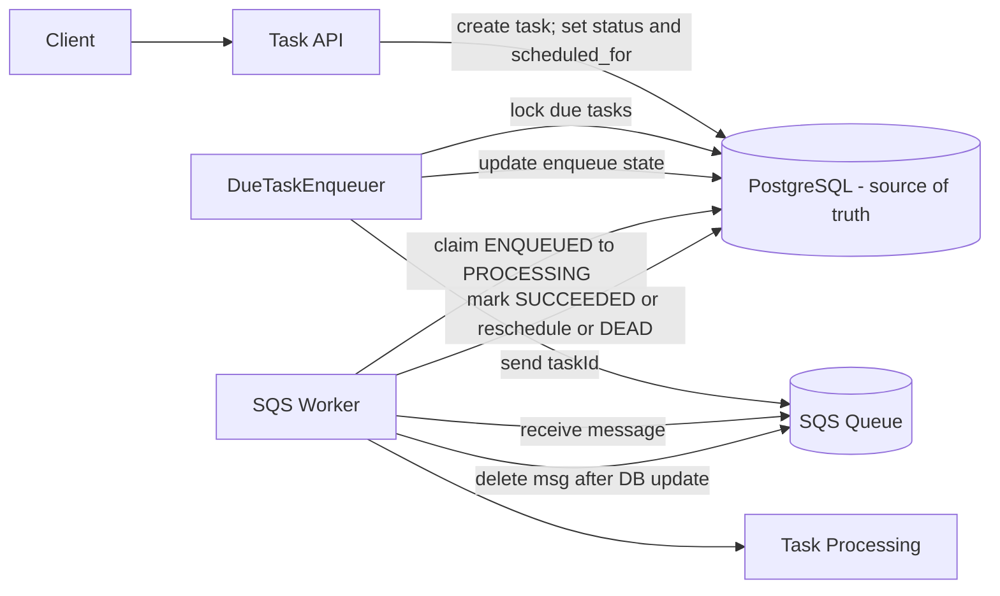

### Mode B — SQS with scheduled_for

### Worker execution model (SQS mode)

1. Worker long-polls SQS for taskId messages
2. Worker atomically claims the task in DB (ENQUEUED → PROCESSING) with guards:
   - scheduled_for <= now()
   - attempt_count < max_attempts
   - worker_id matches the claimer
3. Task processing runs outside any DB transaction
4. Worker updates final state in DB:
   - Success: PROCESSING → SUCCEEDED
   - Failure: PROCESSING → ENQUEUED (scheduled_for = now + backoff) OR → DEAD when attempts exhausted
5. Worker deletes the SQS message **only if** the DB update succeeds (otherwise leave for redelivery)

### Current Architecture
```mermaid
flowchart TB
    Client[Client] --> API[Task API]
    API --> DB[(PostgreSQL - Source of Truth)]

    %% --------------------
    %% Mode A: DB polling
    %% --------------------
    subgraph ModeA["Mode A — DB Polling Worker"]
        DBWorker[DB Worker]
        DBWorker -->|poll eligible tasks| DB
        DBWorker -->|claim PENDING to PROCESSING| DB
        DBWorker --> WorkA[Task Processing]
        DBWorker -->|mark SUCCEEDED or FAILED| DB
    end

    %% --------------------
    %% Mode B: SQS mode
    %% --------------------
    subgraph ModeB["Mode B — SQS with scheduled_for"]
        Enqueuer[DueTaskEnqueuer]
        SQS[(SQS Queue)]
        SQSWorker[SQS Worker]

        Enqueuer -->|lock due tasks| DB
        Enqueuer -->|send taskId| SQS
        Enqueuer -->|update enqueue state| DB

        SQSWorker -->|receive message| SQS
        SQSWorker -->|claim ENQUEUED to PROCESSING| DB
        SQSWorker --> WorkB[Task Processing]
        SQSWorker -->|mark success or reschedule or dead| DB
        SQSWorker -->|delete message after DB update| SQS
    end
