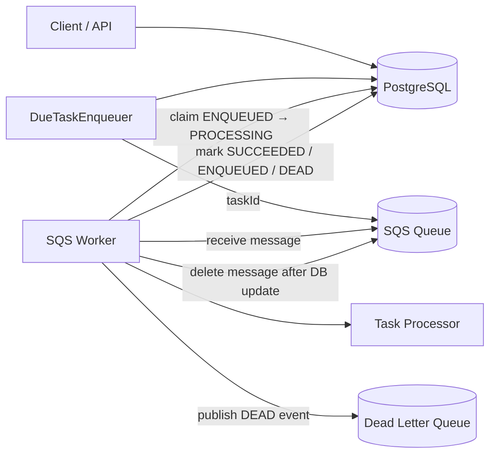

Day 16 Architecture & Processing Guarantees
====================================

High-Level Architecture (After Adding DLQ)
-----------------------

This system supports **two execution modes** while sharing the same database-backed task model:

-   **DB polling mode** (simple, local, no external dependencies)

-   **SQS mode** (distributed, horizontally scalable)

The **database is always the source of truth** for task state.

* * * * *

Why the Database Is the Source of Truth
---------------------------------------

SQS provides **delivery**, not **state**.

All authoritative task state lives in PostgreSQL:

-   `PENDING`

-   `ENQUEUED`

-   `PROCESSING`

-   `SUCCEEDED`

-   `DEAD`

-   `CANCELED`

Reasons:

1.  **Exactly-once state transitions**

    -   Every state change is an atomic SQL update

    -   Workers race safely via conditional updates

2.  **Durability**

    -   If workers crash, restart, or messages redeliver, state is preserved

3.  **Observability**

    -   Task history, retries, errors, and timing are queryable

4.  **Idempotency**

    -   Duplicate SQS messages are harmless; DB claims prevent double execution

> SQS is treated as a *delivery mechanism*, not a workflow engine.

* * * * *

Execution Guarantees
--------------------

### Message Delivery

-   **At-least-once delivery** from SQS

-   Duplicate messages are expected and safe

### Task Processing

-   **At-most-once execution per attempt**

-   Guaranteed by:

    `UPDATE tasks
       SET status = 'PROCESSING'
     WHERE id = ?
       AND status = 'ENQUEUED'`

If this update affects **0 rows**, the worker does nothing.

* * * * *

Failure Handling Model
----------------------

### Retry Strategy

-   `attempt_count` is incremented at claim time

-   On failure:

    -   If `attempt_count < max_attempts` → task is re-ENQUEUED with backoff

    -   If `attempt_count >= max_attempts` → task becomes **DEAD**

### Backoff

-   Simple time-based backoff using `scheduled_for`

-   Prevents hot retry loops

* * * * *

Dead Letter Queue (DLQ)
-----------------------

### Why DLQ Exists (Even Though We Mark Tasks DEAD)

Marking a task `DEAD` answers **"should we retry?"**\
DLQ answers **"what failed, and why?"**

When a task becomes `DEAD`:

-   A **DeadTaskEvent** is published to a dedicated DLQ

-   Contains:

    -   taskId

    -   workerId

    -   attemptCount / maxAttempts

    -   error message

    -   timestamp

This enables:

-   Alerting

-   Offline inspection

-   Manual replay tooling (future work)

-   Audit trails

### DLQ Publishing Semantics

-   DLQ publishing is **best-effort**

-   Even if DLQ publish fails:

    -   The original SQS message is still deleted

    -   Prevents poison-message retry loops

This is a deliberate trade-off:

> **System liveness over perfect observability**

* * * * *

Why Messages Are Deleted Only After DB Update
---------------------------------------------

A message is deleted from SQS **only if**:

-   `markSucceeded(...)` succeeds **or**

-   `markFailedAndRescheduleOutcome(...)` succeeds

If the DB update fails:

-   The message is **not deleted**

-   SQS redelivery ensures another attempt

This guarantees:

-   No task is lost without a recorded state transition

-   DB state always reflects reality

* * * * *

Comparison: DB Polling vs SQS Mode
----------------------------------

| Aspect | DB Polling | SQS Mode |
| --- | --- | --- |
| Scaling | Limited | Horizontal |
| Latency | Poll-based | Event-driven |
| Dependencies | DB only | DB + SQS |
| Delivery guarantee | DB-based | At-least-once |
| Production ready | ❌ | ✅ |

Both modes share the **same task lifecycle and guarantees**.

* * * * *

Design Philosophy
-----------------

-   **State machines > message semantics**

-   **Databases are better at correctness**

-   **Queues are better at delivery**

-   **Failures are first-class citizens**

This system favors **clarity, safety, and debuggability** over cleverness.
