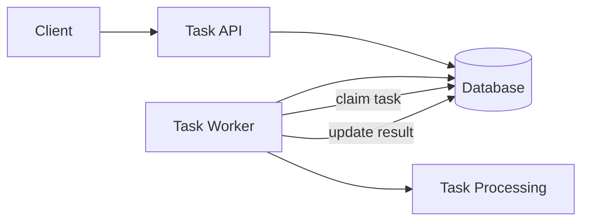

**Worker execution model**

1. Worker polls database for PENDING tasks
2. Worker atomically claims a task (PENDING → PROCESSING)
3. Task processing runs outside any transaction
4. Worker updates final state (PROCESSING → SUCCEEDED / FAILED)

Optimistic locking (`@Version`) is used as a safety net to detect concurrent updates.
